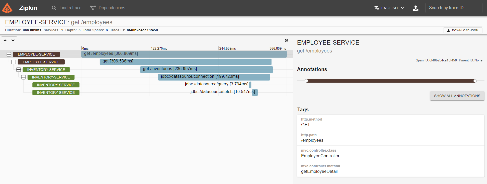
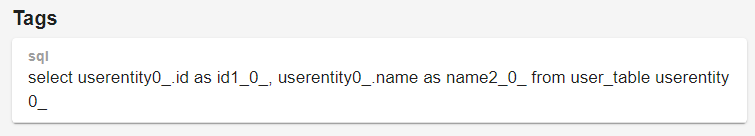
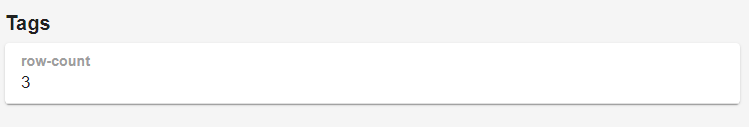

# microservice-pattern-distributed-tracing
This repository serves to demonstrate how to trace calls between services in a microservice environment. This is particularly
important to analyze traffic flow and to identify API bottlenecks and performance issues. Do note that tracing and
logging are separated on purpose. Tools such as ELK stack should be preferred for distributed logging purpose.

### How to run 
#### Using `docker`:
Simply run `start-docker.bat`;

#### Using `docker-compose`:
Simply run `start-compose.bat`

### How to test
1. Make a call to `employee-service` by visiting `http://localhost:9080/employees`
1. Check `zipkin` at `http://localhost:9411/zipkin`. Click `Run Query` and then select the first span to view detail. You should see this:


1. It shows that call to `employee-service`'s `GET /employees` took 366ms.
1. It shows that `employee-service` called `inventory-service`'s `GET /inventories` REST resource.
1. It shows that `inventory-service` made a connection to database and executed some queries.

_protip_,  if you click on the `span` with `jdbc` prefix then you can see these details:
#### Sql executed


#### total rows returned

 
### Libraries
1. `spring-cloud-starter-zipkin` contains both `Sleuth` (add tracing using MDC) and `Zipkin` (send trace to `zipkin` server).  
1. `p6spy-spring-boot-starter` will create proxies that allow JDBC calls to be intercepted and reported to `zipkin`.

### Tool learnings
#### docker
1. It seems that there are no official alpine version of jdk8+ available and that causes image size to increase. Base 
image that's currently used is not officially supported by `alpine`. 
1. If we're running everything in this repo using `docker` only, a container can reach another container by connecting
to `http://host.docker.internal:port` instead of `http://localhost:post`. It seems that `host.docker.internal` is a
special DNS name that resolves to the host machine (a.k.a, the host machine's localhost).
1. It's helpful to run a container with name supplied e.g., `docker run -d --name coolName imageName`. One can then stop
container using name instead of container id e.g., `docker top coolName`

#### docker-compose
1. In `docker-compose`, we don't need to `host.docker.internal`. Instead, we connect to a particular container using
the container's `service name` defined in `docker-compose.yaml`.
1. When connecting from one container to another in `docker-compose`, remember to point to the container(service)'s 
*container port* instead of host port

```yaml
version: "3.8"
services:
  employee: # 'employee' is the 'service-name'
    image: aurelius0523/employee-service
    ports:
      - 9080:8080 
  inventory: # 'inventory' is also 'service name'
    image: aurelius0523/inventory-service
    ports:
      - 9081:8081 # if employee-service needs to call inventory-service, the url will be http://inventory/8081
```